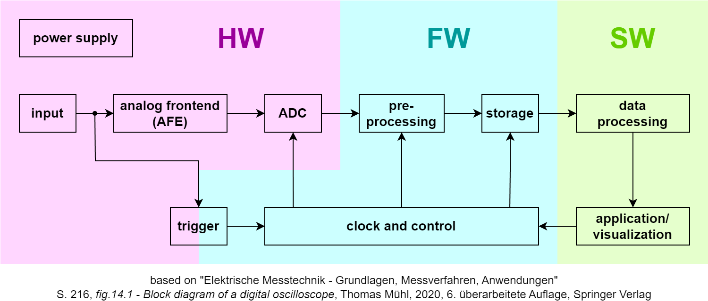

# Introduction
This repository serves as documentation and overview of the project **USB-oscilloscope**,
which was carried out in the summer semester 2025 at the efi faculty of the University of Applied Sciences Nuremberg (Georg-Simon-Ohm).
# Overview
### Project structure:

<ins>legend:</ins> 
HW - hardware 
FW - firmware 
SW - software 
